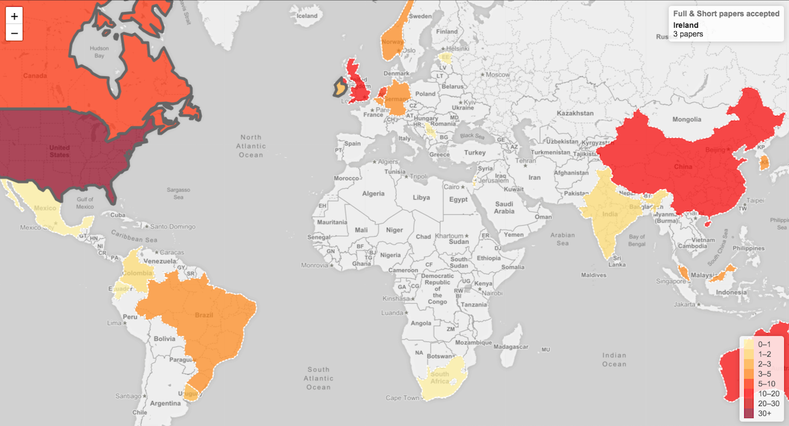
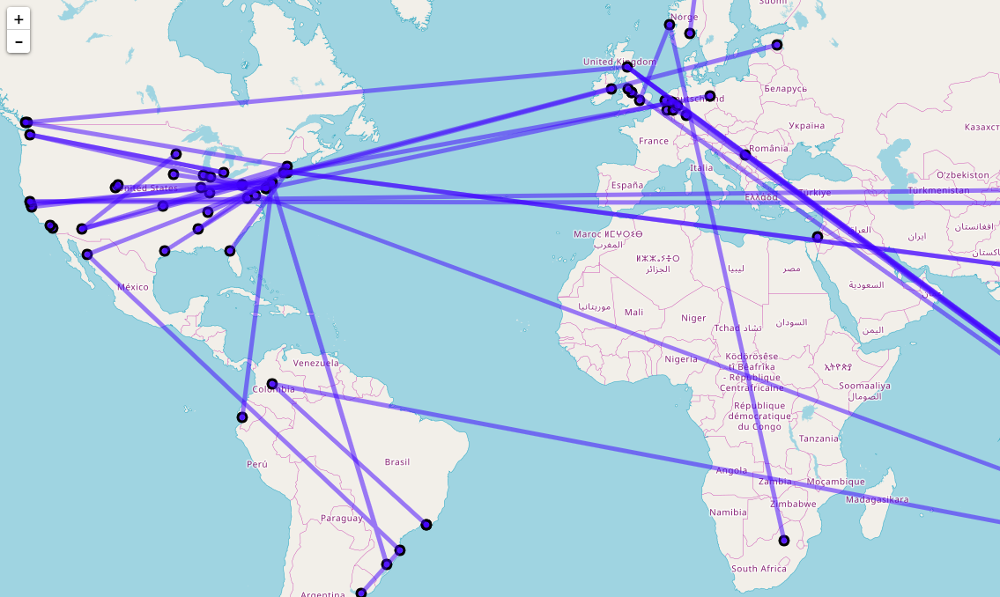

# ACM Proceedings Template

Template to develop programatically the proceedings of an ACM Conference.

This template was used to develop the Proceedings for the 9th International Learning Analytics and Knowledge Conference ([LAK 2019](https://lak19.solaresearch.org)).


## Contributors

* [David Azcona](https://computing.dcu.ie/~dazcona/)
* [Vitomir Kovanovic](https://vitomir.kovanovic.info/) developed the scripts used to check the correctness of a PDF for ACM Proceedings and helped me throughtout the process with tricks and tips.
* [Abelardo Pardo](http://people.unisa.edu.au/Abelardo.Pardo) originally developed the scripts and workflow.

## Technologies

* Python 3
* [Flask](http://flask.pocoo.org/)
* [Bootstrap](https://getbootstrap.com/)
* Javascript
* [Leaflet](https://leafletjs.com/)
* Bash
* LaTeX & [BasicTeX](http://www.tug.org/mactex/morepackages.html): a smaller alternate TeX Distribution
* [PDFtk](https://www.pdflabs.com/tools/pdftk-server/): Merge PDF Documents, Collate PDF Page Scans, Split PDF Pages into a New Document. Rotate PDF Documents or Pages
* [PDFLatex](https://linux.die.net/man/1/pdflatex): convert files from LaTeX to PDF
* [LaTeX's multido's library](https://ctan.org/tex-archive/macros/generic/multido?lang=en)
* [Subprocess Python module](https://docs.python.org/3.6/library/subprocess.html)
* (Optional) [Docker](https://www.docker.com/)

## Deployment

1. Create a virtual environment by executing the command venv:
```
$ python3 -m venv env/
```

2. Activate the virtual environment:
```
$ source env/bin/activate
```

3. Install the dependencies specified in the requirements file:
```
(env) $ pip install -r requirements.txt
```

4. [Optional] List the libraries installed on your environment:
```
(env) $ pip freeze
```

5. [Optional] Run the following program to save the GEO coordinates of the authors' universities:
```
(env) $ python src/location.py
```
The programs stores the GEO coordinates calling Google Maps' API.

6. [Optional] Run the development server to visualize the papers' info and some cool viz!:
```
(env) $ python src/app.py
```

7. [Optional] Run this command to generate a wordcloud PNG with the words of the papers' titles:
```
(env) $ python src/cloud.py
```

8. Create a document using a text editor (e.g. Microsoft Word) as the FRONT of the Proceedings document.

9. Run the following shell script to get the committee's names, countries and universities:
```
(env) $ bash src/committee.sh
```
This information has to be manually copied to the Front document of the Proceedings.

10. Analyse the papers to see if they have any formatting issues:
```
(env) $ python src/analyse.py
```
Checking each paper for issues is done within the script by:
* Bash script (check.sh) using pdftotext and pdffonts tools
* Python procedures using PyPDF2
I a paper fail these tests, it is typically due to the copyright info / ACM Reference Format / Venue / etc missing. Also, fonts not being embedded on the PDF (which is a requirement by ACM) is a general problem. One way of fixing the fonts is using the tool ghostscript (might not work for all cases):
* e.g. bash ghostscript.sh 'data/papers/paper.pdf' /Library/Fonts/ArialMT.ttf;/Library/Fonts/Helvetica.ttf' 'data/papers/paper_fonts_embedded.pdf'"

11. Merge all the papers with the FRONT page to build the final proceedings document and build the papers to upload to ACM:
```
(env) $ python src/merge.py
```
The pagination for the ACM-ready papers and final proceedings document is done within the script by:
* Create a LaTeX file with only numbers using the multido package
* Create a PDF of that LaTeX file using pdflatex
* Stamp those numbers on the PDF paper using pdftk

12. You are done! Enjoy your conference proceedings document!
The command to deactivate virtual environment:
```
(env) $ deactivate
```

## Web Application

To visualize the graphs you can either use the virtual environment or Docker containers:

### a) Virtual Environment using Bash

Run the development server to visualize the papers' info and some cool viz!:
```
(env) $ python src/app.py
```

### b) Docker

Build image with Docker Compose using the Makefile's command:
```
$ make build
```

Run the image to start the container:
```
$ make run
```





# Resources

* LAK18 in numbers: https://www.slideshare.net/xaoch/lak18-program-in-numbers
* Numbering PDF Pages With pdftk: http://cazencott.info/index.php/post/2015/04/30/Numbering-PDF-Pages
* PDFtk hanging on MacOS Sierra: https://stackoverflow.com/questions/39750883/pdftk-hanging-on-macos-sierra
* pdflatex add an output directory: https://latex.org/forum/viewtopic.php?t=26360